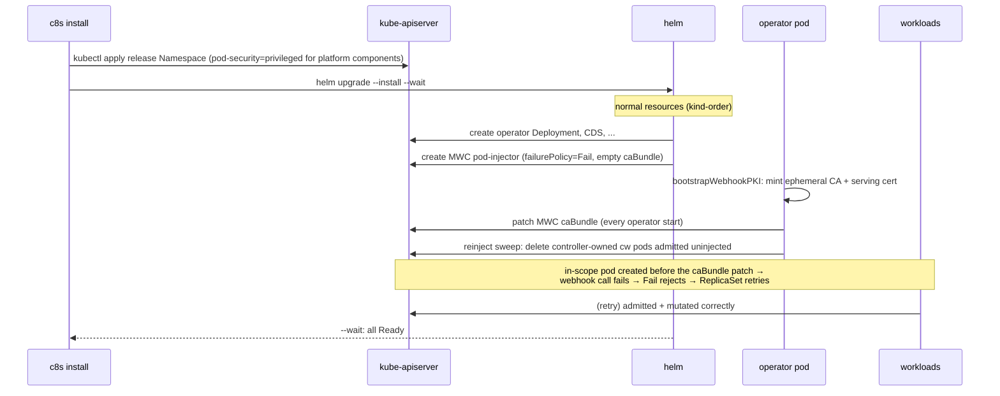
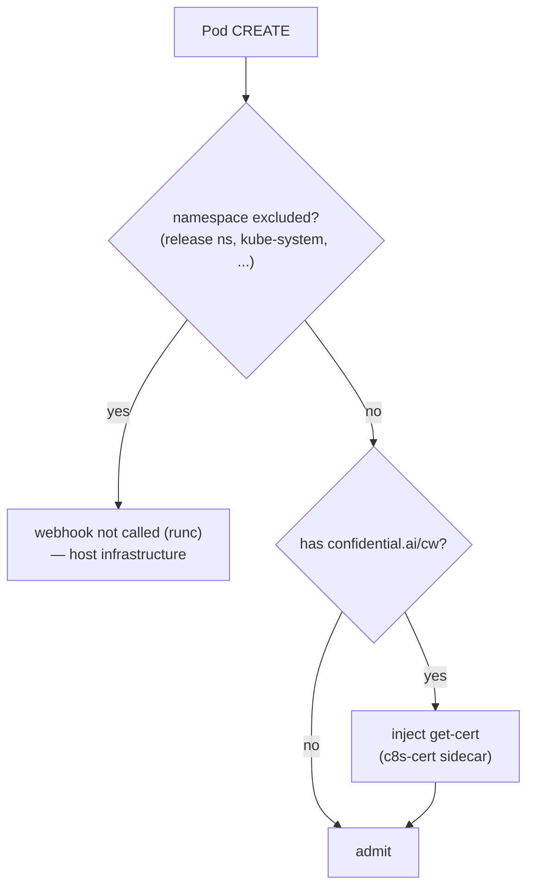
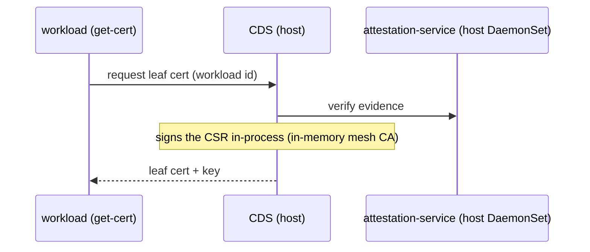
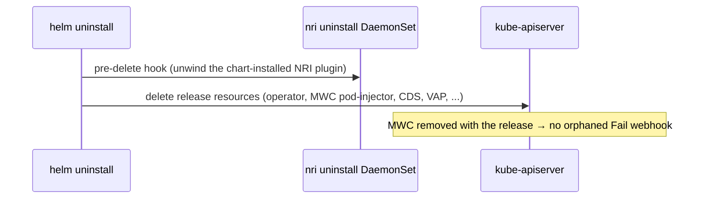

# c8s install flows and features

How `c8s install` assembles the platform on confidential nodes. This overview
connects the deeper docs:

- [`operator.md`](operator.md) — the operator, webhook, and controllers.
- [`ratls.md`](ratls.md) — certificate and attestation flows.
- [`allowlist-and-capabilities.md`](allowlist-and-capabilities.md) — image admission.

The source of truth for the mode→helm-args mapping is `cmd/c8s/install.go`
(`appendCvmModeInstallArgs` / `appendDistroInstallArgs`); for the rendered
resources, `internal/helmchart/c8s/templates/`.

---

## Deployment modes

`c8s install` runs `helm upgrade --install` against the embedded chart. The
required `--cvm-mode` selects `node`, `gke`, or `aks`. All run normal Kubernetes
pods on confidential nodes. The node is a single trust domain; use separate
nodes for tenants that do not trust each other.

| Mode | Deployment | Evidence |
|---|---|---|
| `node` | c8s measured node image; baked attestation API and NRI plugin | Native SNP/TDX |
| `gke` | GKE confidential nodes; chart-managed security services | Native TEE device |
| `aks` | AKS confidential nodes; chart-managed security services | Azure vTPM |

`--hardware-platform` is also required: `sev-snp` or `tdx`.

There is no distro flag: the host distro (`k8s` vs `rke2`), which picks the
containerd config paths for nri-image-policy in every mode,
is detected from the cluster's kubelet versions (`+rke2` build suffix →
rke2). An install with `-f` values owns the distro instead: set
`nriImagePolicy.distro` there if the chart default (`k8s`)
doesn't fit — a mixed cluster cannot be detected and always needs that, plus
nodeSelectors to partition the install.

| distro | containerd config dir | Notes |
|---|---|---|
| `k8s` | `/etc/containerd` | Vanilla / kubeadm clusters |
| `rke2` | `/var/lib/rancher/rke2/agent/etc/containerd` | RKE2 |

On RKE2, nri-image-policy registers with containerd through a drop-in file.
It loads only if the containerd config imports the drop-in directory. The
chart's `containerd-prep` initContainer adds a missing import to the rendered
config **and** the RKE2 template, so it survives config regeneration. The
paths follow the config schema version (`config-v3.toml.d` for schema v3).
Because it lives in the chart, this runs for both `c8s install` and GitOps
`HelmRelease` installs without manual containerd-template edits.

---

## What runs where

| Component | Runs on |
|---|---|
| c8s operator (webhook + controllers) | Ordinary pod; release namespace is webhook-exempt |
| MWC `pod-injector` | Cluster resource, tracked by the release |
| CDS (verify + mesh CA + leaf signing) | Ordinary pod inside the node CVM |
| attestation API | Baked service in `node` mode; chart DaemonSet in `gke`/`aks` |
| ratls-mesh | Node DaemonSet |
| nri-image-policy | Node process launched by containerd; baked binary in `node` mode |
| get-cert injection (`confidential.ai/cw` pods) | Webhook at admission time |
| tls-lb | Ordinary pod inside the node CVM |

---

## Trust boundary

There is no per-pod confidentiality. Everything runs in ordinary
containers the host kernel can read. The mesh/attestation components operate at
the node level; they do not hide pod memory from the host. The node is a single
trust domain, so this mode is **single-tenant**: every pod on it can reach what
any other pod on it can reach.

```
 HOST (trusted in this mode)
 ┌─────────┐ ┌────────┐ ┌────────────┐ ┌───────────────────┐
 │operator │ │  CDS   │ │ratls-mesh  │ │attestation-service│
 │+webhook │ │ (runc) │ │nri-img-pol │ │   (host DaemonSet) │
 └─────────┘ └────────┘ └────────────┘ └───────────────────┘
```

---

## Install flow (ordering)

The MWC `pod-injector` is an **ordinary release-tracked resource**: Helm's
kind-order applies it *after* the Deployments, with an empty `caBundle` and
`failurePolicy: Fail`. The chart's own pods never depend on it — the MWC's
namespaceSelector excludes the release namespace — and workload pods are
annotated only after `helm --wait` reports the release ready.



Key properties (see `templates/webhook.yaml`, `controller/runner.go`):

- **`failurePolicy: Fail`** means the window where the MWC exists but the
  operator hasn't patched the caBundle yet *fails closed* — pod creation is
  rejected and retried, never admitted as an unmutated runc pod.
- The **chart's own components are exempt** via the MWC's namespaceSelector,
  which excludes the release namespace (plus `kube-system`, `kube-public`,
  `kube-node-lease`, and `webhook.extraExcluded`), so the operator can always
  boot to patch the caBundle — no deadlock.
- The webhook CA is **ephemeral**: `bootstrapWebhookPKI` re-mints it and
  re-patches the caBundle on every operator start. The chart renders the
  `caBundle` field only when `webhook.caBundle` is set, so a `helm upgrade`
  leaves the operator-patched bundle in place and MWC spec changes roll out
  like any other resource.
- A `cw` pod admitted while the webhook was unavailable (e.g. before the MWC
  existed on first install) cannot self-heal — admission fires only on CREATE
  — so the operator runs a **one-shot reinject sweep** at startup that deletes
  controller-owned `cw` pods missing injection; their controllers recreate
  them through the webhook.
- CDS comes up during the main install and, living in the excluded release
  namespace, is never gated on the webhook — bootstrap services must not be
  gated behind the workloads that depend on them.

---

## Admission flow

Every CREATE of a pod in an in-scope namespace hits the `pod-injector` MWC. The
operator's handler (`internal/webhook/pod_mutator.go`) decides:



Get-cert injection is keyed off the pod, not a CR: the
`confidential.ai/cw=<id>` annotation drives it in every mode. It injects a
`c8s-cert` native sidecar that fetches the leaf cert from CDS on startup and
renews it on a ticker, plus a `c8s-cert-wait` run-once init container
(`/c8s probe-file --wait`) that blocks until the initial cert is written so
downstream containers wait for it before launching.

**Excluded namespaces** in the MWC's namespaceSelector are the release
namespace (operator, CDS, and other platform components), `kube-system`,
`kube-public`, `kube-node-lease`, and `webhook.extraExcluded`.
The separate `deny-host-namespaces` policy rejects host namespaces outside
trusted platform namespaces.

CDS carries no `cw` annotation: a get-cert sidecar would dial CDS, and CDS
dialing itself from its own init container is a bootstrap deadlock. It
self-provisions its serving cert via RA-TLS.

---

## Certificate and attestation flows

**Node attestation.** Workloads annotated `cw` get a get-cert sidecar
that dials CDS over the cluster Service (`--cds-url`); CDS verifies the request
against the **host** attestation-service DaemonSet and signs the CSR with its
in-memory mesh CA — verify and sign happen in one process.



---

## Uninstall flow

The MWC is release-tracked, so `helm uninstall` deletes it along with every
other release resource — a `failurePolicy: Fail` webhook pointing at a deleted
operator Service cannot leak and block pod creation cluster-wide. The only
`pre-delete` hook in the chart is the nri-image-policy uninstall DaemonSet
(`templates/nri-image-policy-uninstall-hook.yaml`), which
unwinds the host-side NRI plugin install before the release goes.



**`c8s uninstall`** wraps the Helm step and adds a host sweep after the release
is gone. A short-lived privileged DaemonSet removes chart-installed NRI policy,
mesh netfilter state, and managed containerd-prep templates, preserving baked
node-image components. Release values are read before deletion so install-time
`-f` overrides are honored. `--host-sweep=false` skips the sweep;
`--host-sweep-only` recovers a cluster whose release a bare `helm uninstall`
already deleted. See [`operator.md`](operator.md#uninstall).

---

## Quick reference

```bash
# Every flow below also requires --hardware-platform (the nodes' CPU TEE:
# sev-snp or tdx). --operator-keys authorizes `c8s allowlist` writes; a -f
# values file may carry the keys instead, and --force installs without.
# --upstream (with the port on its --workload-ref) points tls-lb at an adopted
# workload's mesh-wrapped headless Service (see operator.md, "tls-lb upstream").

# Base — normal cluster, host-side components, no per-pod confidentiality.
c8s install --cvm-mode=node --hardware-platform=sev-snp --operator-keys operator-pub.pem \
  --workload-ref vllm=vllm/deployment/serving:8000 --upstream vllm

# Uninstall: helm uninstall + sweep chart-installed host artifacts.
c8s uninstall
```

For the deeper "why", follow the cross-links at
the top of this document.
